# PHP Assignment 1
---

### Task 1 - Age Check
Checks whether the user's age is greater than 18.

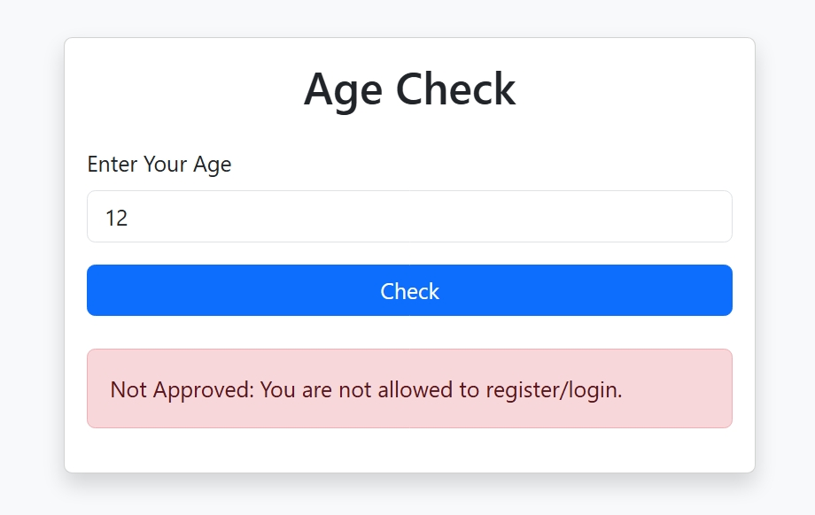

---

### Task 2 - Two Numbers Calculator
Calculates:
- Product
- Difference
- Quotient

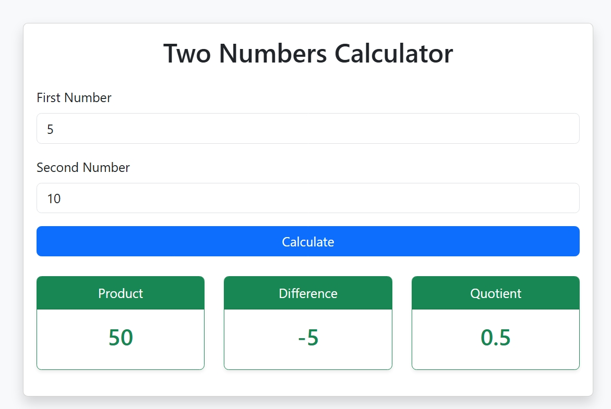

---

### Task 3 - Sum of Array
Calculates the sum of an array of numbers entered by the user.
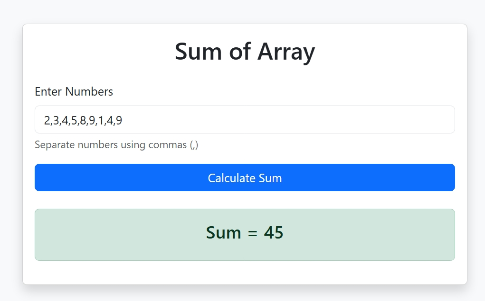

---

### Task 4 - Search Movie
Searches for a movie title inside an array.

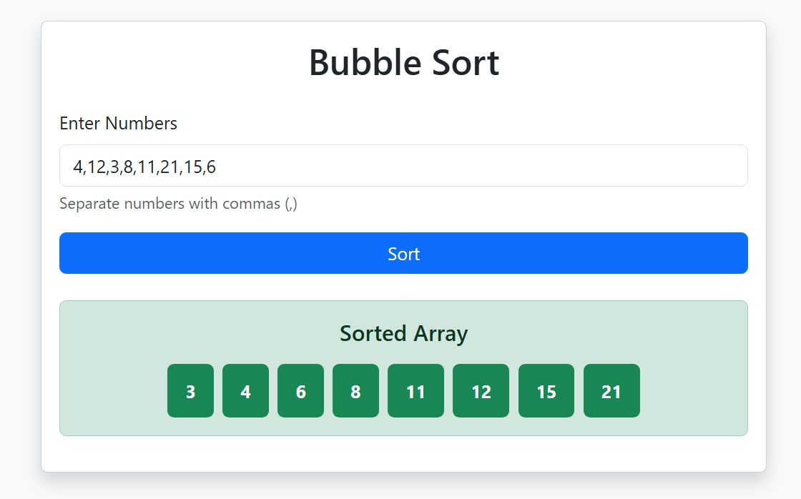

---

### Task 5 - Bubble Sort
Sorts an array using the Bubble Sort algorithm.
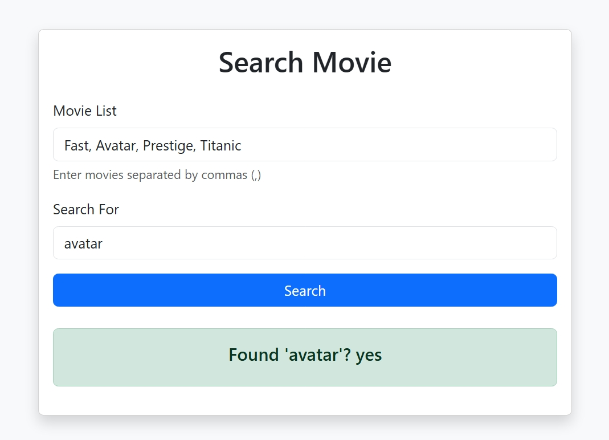

---

### Task 6 - Find Maximum
Finds the largest number in an array.
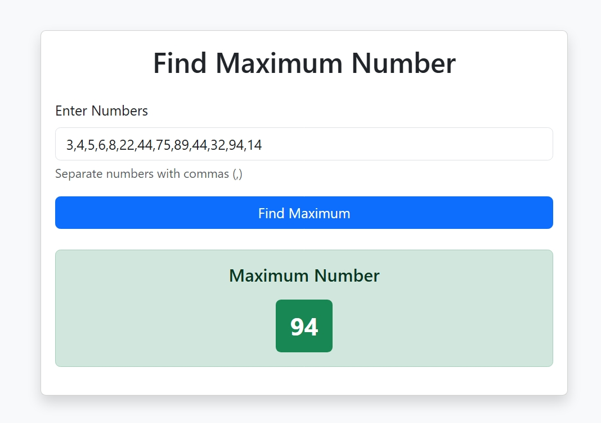

---

### Task 7 - Count Movie Repetition
Counts how many times a movie title appears inside an array.
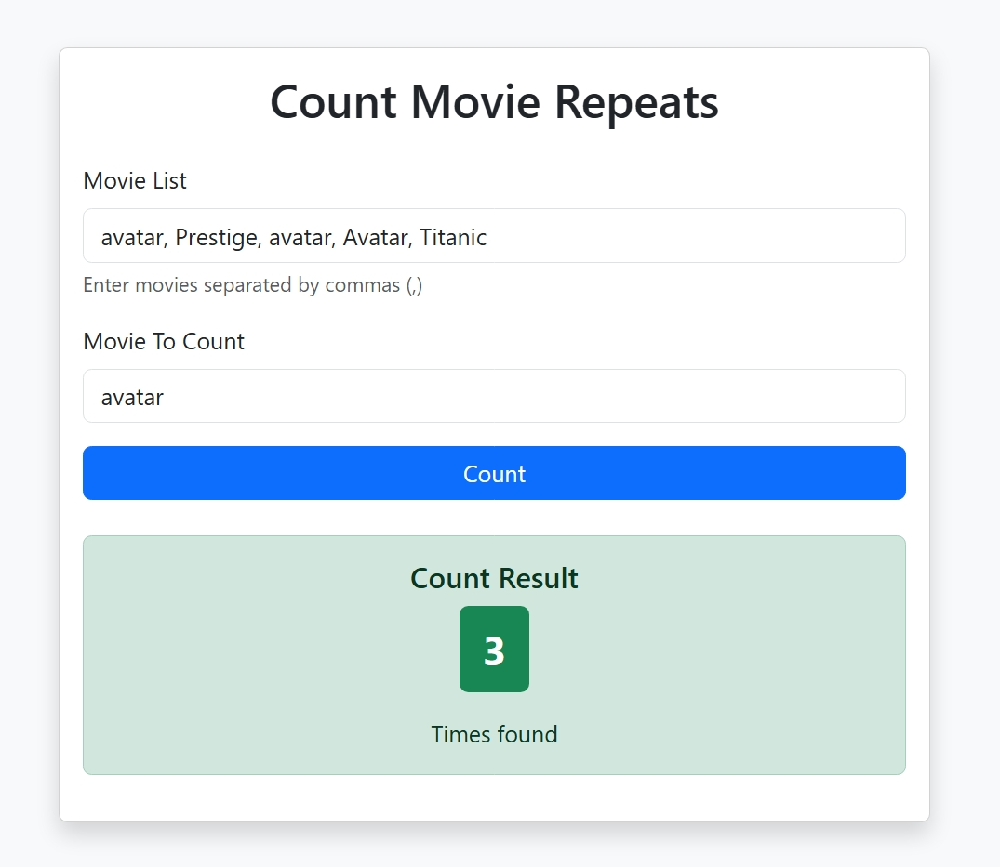

---

### Task 8 - Random Password Generator
Generates a random password with a user-defined length.
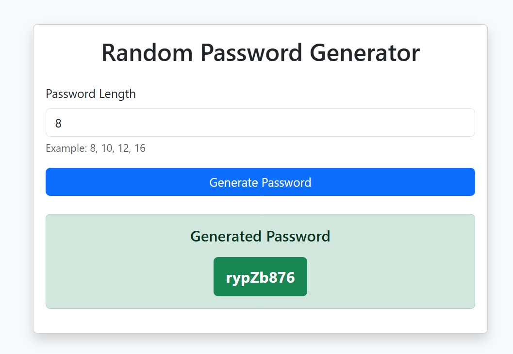

---

### Task 9 - Boolean Display
Displays boolean values as **Yes** or **No** while displaying other values normally.
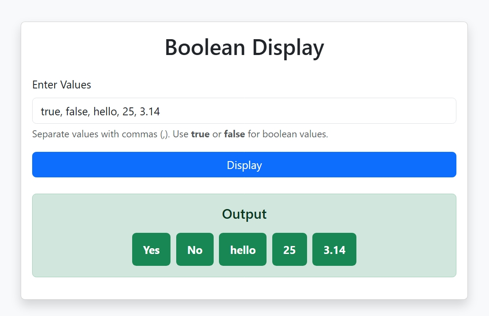

---

### Task 10 - Sorting
Sorts an array:
- Ascending
- Descending
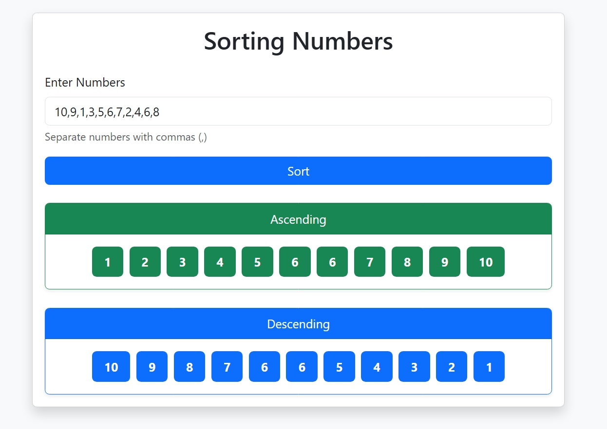

---

### Task 11 - Common Values
Finds the common values between two arrays.
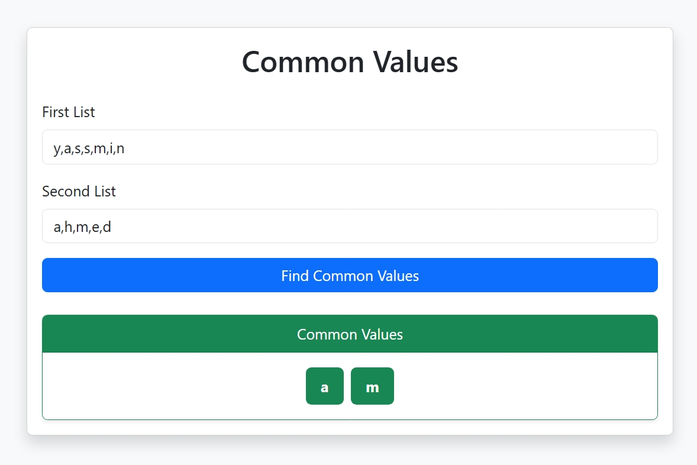

---

### Task 12 - E-commerce Invoice
Calculates:
- Total Price
- Discount
- Final Price

Validation:
- Numeric input
- No negative values
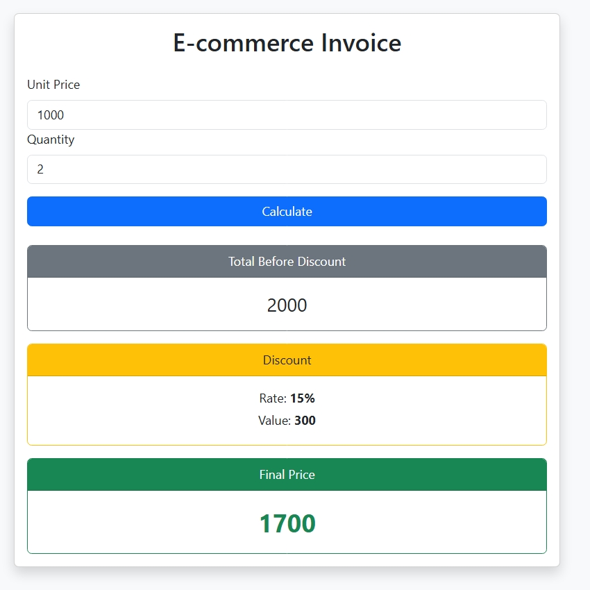

---
